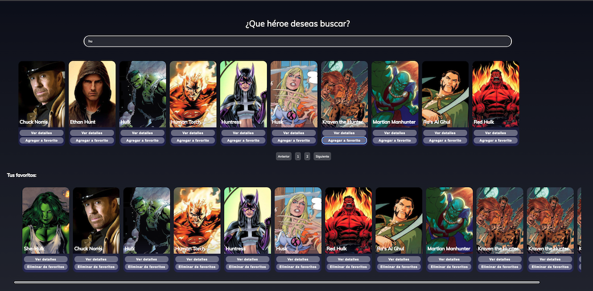
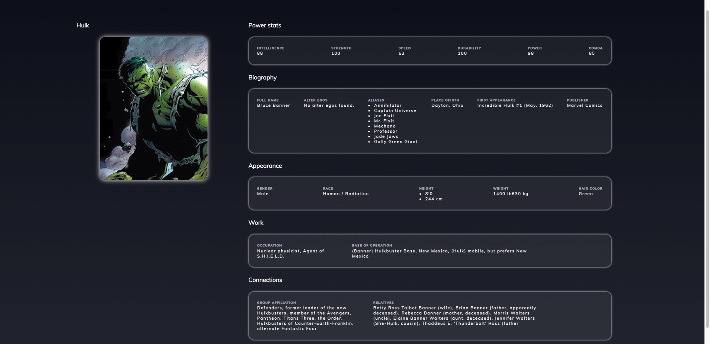

# Front-End Heroes Cencosud

App de tipo galería donde se realizan busqueda de heroes y se puede consultar los detalles de cada uno de ell@s, **este producto es un MVP**

### Appearance:
* Home:
 
* Detalle Heroe:
 


### Rutas  :

| Ambient       |           URL                      |
| ------------- | -----------------------------------|
|Produccion     |https://cencosud-test.herokuapp.com/|
|Local          |http://localhost:3000/              |

Technology
---
* ⚛️ React.js 

Getting Started
---
### Install dependencies :
```
>  npm install
````

### Start :
```
>  npm start
````

### Build in *Heroku*:
* push
````
>  heroku container:push web -a cencosud-test
````
* release
````
>  heroku container:release web -a cencosud-test
````

Collaborate 
---
- Autor: **Soraimar Bernal** 